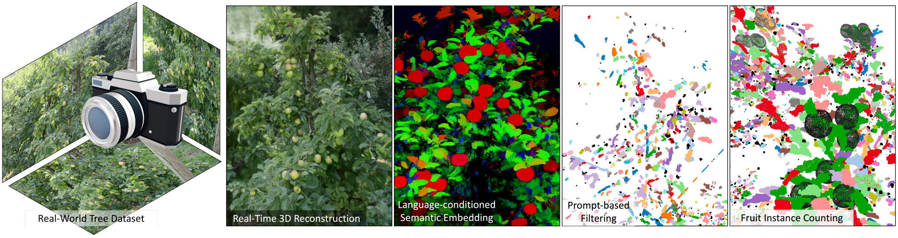

# 🍎 CountingFruit: Real-Time 3D Fruit Counting with Language-Guided Semantic Gaussian Splatting

<p align="center">
  
</p>

This repository contains the **official implementation** of the paper:

**CountingFruit: Real-Time 3D Fruit Counting with Language-Guided Semantic Gaussian Splatting**  
📄 [arXiv](https://arxiv.org/abs/2506.01109) ｜ 🌐 [Project Page](https://fruitlanggs.github.io/)

---

## 🔍 Highlights

- ✅ **Real-time 3D fruit counting** with **>300 FPS** rendering speed  
- ✅ **Open-vocabulary semantic control** using **language-conditioned 3D Gaussians**  
- ✅ **Fully 3D prompt-based filtering** without per-frame supervision  
- ✅ **Robust to occlusion** and cluttered orchard environments  
- ✅ **Fast** while achieving **better accuracy**

---

## 🧾 Abstract

<div style="max-width: 800px; margin: auto; font-size: 0.9em;">

Accurate 3D fruit counting in orchards is challenging due to heavy occlusion, semantic ambiguity between fruits and surrounding structures, and the high computational cost of volumetric reconstruction. Existing pipelines often rely on multi-view 2D segmentation and dense volumetric sampling, which lead to accumulated fusion errors and slow inference. We introduce FruitLangGS, a language-guided 3D fruit counting framework that reconstructs orchard-scale scenes using an adaptive-density Gaussian Splatting pipeline with radius-aware pruning and tile-based rasterization, enabling scalable 3D representation. During inference, compressed CLIP-aligned semantic vectors embedded in each Gaussian are filtered via a dual-threshold cosine similarity mechanism, retrieving Gaussians relevant to target prompts while suppressing common distractors (e.g., foliage), without requiring retraining or image-space masks. The selected Gaussians are then sampled into dense point clouds and clustered geometrically to estimate fruit instances, remaining robust under severe occlusion and viewpoint variation. Experiments on nine different orchard-scale datasets demonstrate that FruitLangGS consistently outperforms existing pipelines in instance counting recall, avoiding multi-view segmentation fusion errors and achieving up to 99.7\% recall on Pfuji-Size\_Orch2018 orchard dataset. Ablation studies further confirm that language-conditioned semantic embedding and dual-threshold prompt filtering are essential for suppressing distractors and improving counting accuracy under heavy occlusion. Beyond fruit counting, the same framework enables prompt-driven 3D semantic retrieval without retraining, highlighting the potential of language-guided 3D perception for scalable agricultural scene understanding.

</div>


## 🔗 Links

- 🌐 **Project Page:** [fruitlanggs.github.io](https://fruitlanggs.github.io/)  
- 📄 **arXiv Paper:** [arXiv:2506.01109](https://arxiv.org/abs/2506.01109)

---

## Overview

- Scene Reconstruction with Adaptive Splatting
- Language-Conditioned Semantic Embedding
- Prompt-Based Filtering and Counting


---

## Cloning the Repository

The repository contains submodules, thus please check it out with 
```shell
# SSH
git clone git@github.com:Cola-1/FruitLangGS.git --recursive
```
or
```shell
# HTTPS
git clone https://github.com/Cola-1/FruitLangGS.git --recursive
```


---
## Datasets
In the experiments section of our paper, we primarily utilized three datasets: the FruitNeRF Benchmark dataset, PFuji-Size dataset and other three trees (Galafab-West, Schnico-Red-East, Schniga-Schnico-
West) dataset.

The  FruitNeRF Benchmark (3Tree and Fuji-SfM) dataset is accessible for download via the following link: [3Tree Dataset](https://zenodo.org/records/10869455) and the [Fuji-SfM Dataset](https://zenodo.org/records/3712808) .

The  PFuji-Size (Orch2018 and Orch2020) dataset is accessible for download via the following link: [PFuji-Size Dataset](https://dataverse.csuc.cat/dataset.xhtml?persistentId=doi:10.34810/data141).

The  Galafab-West, Schnico-Red-East, Schniga-Schnico-West dataset is accessible for download via the following link: [ Galafab-West, Schnico-Red-East, Schniga-Schnico-West Dataset](https://www.siscog.pt/en-gb/lp/paper-v4a2024/).


---

### Setup

#### Environment Setup

Our default, provided install method is based on Conda package and environment management:
```shell
conda env create --file environment.yml
conda activate fruitlanggs
```

---

## Processing the Scenes

### Before getting started

Please download open_clip_pytorch_model.bin from "https://huggingface.co/laion/CLIP-ViT-B-16-laion2B-s34B-b88K" to ```clip_vit_b16/```. 

Please install [segment-anything-langsplat](https://github.com/minghanqin/segment-anything-langsplat) and download the checkpoints of SAM from [here](https://github.com/facebookresearch/segment-anything) to ```ckpts/``` or download sam_vit_h_4b8939.pth from " https://huggingface.co/HCMUE-Research/SAM-vit-h" to ```ckpts/```.

### Start
**Step 1: Gaussian Reconstruction**

We provide pretrained models [BaiduWangpan](https://pan.baidu.com/s/17r9WV4w1GAUGMMOb-08WQQ?pwd=83f9) | [GoogleDrive](https://drive.google.com/drive/folders/1MpD-Kz8B_4EWuOszln_Zhl-b1XeCtShO?usp=drive_link).
Download the archive from our Releases page and extract it into the project root.

Using pretrained models and organizing the data following the [3dgs](https://github.com/graphdeco-inria/gaussian-splatting) repository format. 

**Step 2: Preprocess language features**
```
python preprocess.py --dataset_path scene_name
```

**Step 3: Train semantic autoencoder**
```
cd autoencoder
python train.py --dataset_path ../FruitLangGS/scene_name --dataset_name data_yourScene --encoder_dims 256 128 64 32 3 --decoder_dims 16 32 64 128 256 256 512 --lr 7e-4
```

**Step 4: Generate 3D semantic features**
```
python test.py --dataset_path ../FruitLangGS/scene_name --dataset_name scene_name
```


**Step 5: Multi-level language-conditioned training**

Back to folder ```FruitLangGs/```
```
python train.py -s scene_name -m output --start_checkpoint scene_name/output/chkpnt30000.pth --feature_level 1
# Repeat with --feature_level 2 and 3 as needed
```

**Step 6: Prompt-Based Semantic Segmentation**
```
python semantic_segmentation.py --checkpoint_path output_1/chkpnt30000.pth --prompts "apple" "fruit" --N_prompts "tree" "leaf" --cosine_thresh 0.22555 --neg_thresh 0.261255 --cube_size 4 --autoencoder_ckpt autoencoder/ckpt/scene_name/best_ckpt.pth
```

<details>
<summary><strong>Command Line Arguments for semantic_segmentation.py</strong></summary>

- #### `--checkpoint_path`  
  Path to the pretrained LangSplat `.pth` checkpoint. 

- #### `--prompts`  
  **positive prompts** . Only Gaussians with cosine similarity > `--cosine_thresh` to these prompts are retained.

- #### `--cosine_thresh`  
  Cosine similarity threshold for positive prompts.

- #### `--N_prompts`  
  **negative prompts**. Gaussians with similarity > `--neg_thresh` to these prompts will be removed.

- #### `--neg_thresh`  
  Threshold for negative filtering.

- #### `--cube_size`  
  Crops scene to a cube of side length (in meters). Useful for removing distant Gaussians. Default is `10.0`.

- #### `--autoencoder_ckpt`  
  Path to the semantic autoencoder `.pth` file used to encode CLIP features into 3D vectors.

</details>

**Step 7: Point-Cloud Sampling**
```
python gs2pc/gauss_to_pc.py --input_path apple_fruit.ply --num_points 2100000 --min_opacity 0.1 --colour_quality ultra --exact_num_points --clean_pointcloud --output_path scene_name/scene_name_pc.ply --max_sh_degree 0 --no_render_colours
```

<details>
<summary><strong>Command Line Arguments for gauss_to_pc.py</strong></summary>

- #### `--input_path`
  Path to the filtered `.ply` file (e.g., `apple_fruit.ply`).

- #### `--output_path`
  Path to save the output point cloud file (must be a `.ply` file).

- #### `--renderer_type`
  Rendering backend, choose from `cuda` (default) or `python`.

- #### `--num_points`
  Number of points to sample. Adjust based on Gaussian count and desired density.

- #### `--exact_num_points`
  Ensures exactly `--num_points` are sampled.

- #### `--min_opacity`
  Filters out Gaussians with opacity lower than this threshold. Helps reduce noise.

- #### `--visibility_threshold`
  Default `0.05`. Removes Gaussians with negligible visibility contributions.

- #### `--clean_pointcloud`
  Enables outlier removal from the final point cloud.

- #### `--generate_mesh`
  If enabled, attempts mesh reconstruction (usually not needed).

- #### `--poisson_depth`
  Poisson mesh reconstruction depth (default `10`). Higher values produce more detail.

- #### `--laplacian_iterations`
  Number of smoothing iterations for mesh post-processing (default `10`).

- #### `--mesh_output_path`
  Path to save the reconstructed mesh. Must be a `.ply` file.

- #### `--camera_skip_rate`
  Skips N frames between each camera rendering. Reduces compute time, works best with linear camera paths.

- #### `--no_render_colours`
  Disables color rendering. Speeds up sampling but may result in unrealistic colors.

- #### `--colour_quality`
  Sets the output color quality. Choose from: `tiny`, `low`, `medium`, `high`, `ultra`.

- #### `--max_sh_degree`
  Spherical harmonic degree used in rendering (must match training, typically `0` or `3`).

</details>


**Step 8: Clustering and Counting**


Before running the clustering script, make sure to modify the following files:

#### 🔧 `clustering/config_real.py`

Locate and modify the line:

```python
Baum_01_unet = { "path": "<path to scene_name_pc.ply>" }
```

Replace the path string with the full path to the `.ply` point cloud you just generated (e.g., from `gauss_to_pc.py`).

#### 🧩 `clustering/run_clustering.py`

Also ensure that the correct scene name is included in the active clustering list:

```python
Baums = [Baum_01_unet]  # Add or replace with your scene
# For Fuji dataset, use: Baums = [Fuji_unet]
```

> Once both files are correctly configured, run:

```shell
python clustering/run_clustering.py
```
> ✅ The final output will include the estimated 3D fruit count.
---
## TODO list:
- [x] update the arxiv link
- [x] release the preprocessed dataset and the pretrained model
- [x] release more preprocessed dataset and the pretrained model (coming soon)
- [x] release the code of the eval

---
## 📜 Citation

If you find this work useful, please consider citing:

```bibtex
@article{li2025countingfruit,
  title={CountingFruit: Real-Time 3D Fruit Counting with Language-Guided Semantic Gaussian Splatting},
  author={Li, Fengze and Liu, Yangle and Ma, Jieming and Liang, Hai-Ning and Shen, Yaochun and Li, Huangxiang and Wu, Zhijing},
  journal={arXiv preprint arXiv:2506.01109},
  year={2025}
}
